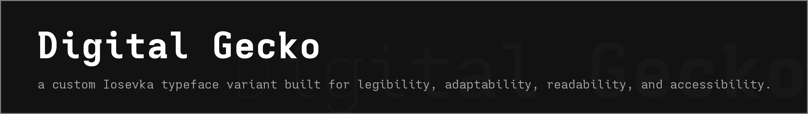
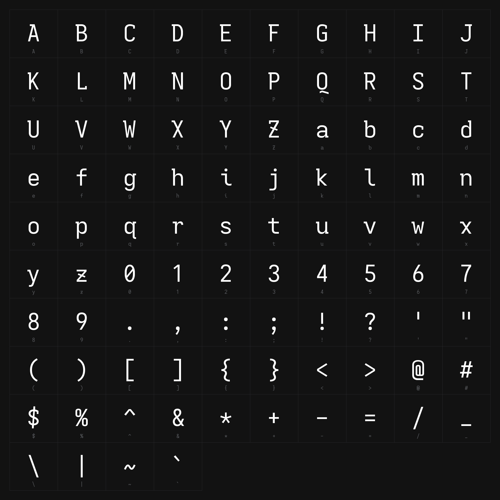
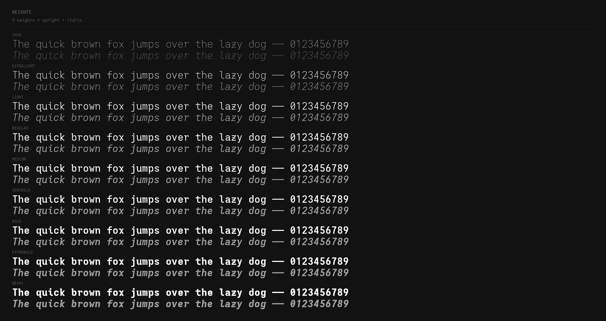
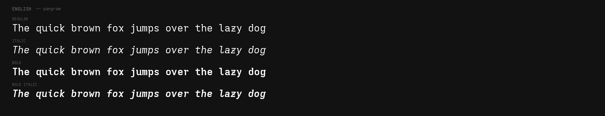
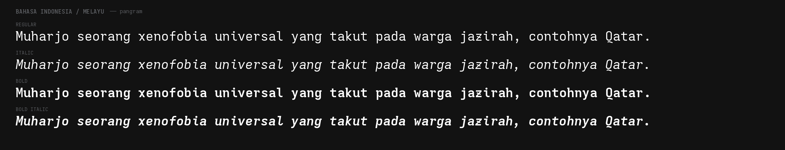
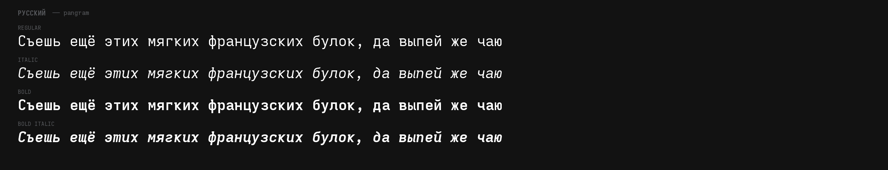
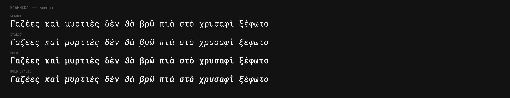

<picture>
  <source media="(prefers-color-scheme: dark)" srcset="src/banner.png">
  <source media="(prefers-color-scheme: light)" srcset="src/banner-light.png">
  
</picture>

## overview

this repository contains a specialized build of [Iosevka](https://github.com/be5invis/Iosevka) designed specifically for use on my personal website. the variant emphasizes clear letterforms and carefully selected glyphs to ensure the font remains readable across different media, screen sizes, and accessibility contexts.

<picture>
  <source media="(prefers-color-scheme: dark)" srcset="src/preview.png">
  <source media="(prefers-color-scheme: light)" srcset="src/preview-light.png">
  
</picture>

all previews use extended, that's what the website uses.

<picture>
  <source media="(prefers-color-scheme: dark)" srcset="src/preview-weights.png">
  <source media="(prefers-color-scheme: light)" srcset="src/preview-weights-light.png">
  
</picture>

## pangram showcase

<picture>
  <source media="(prefers-color-scheme: dark)" srcset="src/sample-en.png">
  <source media="(prefers-color-scheme: light)" srcset="src/sample-en-light.png">
  
</picture>

<picture>
  <source media="(prefers-color-scheme: dark)" srcset="src/sample-id.png">
  <source media="(prefers-color-scheme: light)" srcset="src/sample-id-light.png">
  
</picture>

<picture>
  <source media="(prefers-color-scheme: dark)" srcset="src/sample-ru.png">
  <source media="(prefers-color-scheme: light)" srcset="src/sample-ru-light.png">
  
</picture>

<picture>
  <source media="(prefers-color-scheme: dark)" srcset="src/sample-el.png">
  <source media="(prefers-color-scheme: light)" srcset="src/sample-el-light.png">
  
</picture>

## design choices

the custom variant includes:

- **numerals**: slashed zero (more distinguishable), no-base one, flat-top three
- **letters**: sans-serif design with selective serifs on capitals for contrast
- **spacing**: normal monospace proportions for optimal web rendering
- **ligatures**: limited to discretionary ligatures for programming contexts
- **symbols**: compact at-sign and through dollar sign for clean appearance

the configuration is defined in `digitalgecko.toml` using Iosevka's build system.

<details>
<summary>supported languages / scripts — 7562 glyphs</summary>

*tl;dr, basically all what upstream Iosevka supported*

* **latin** — 95 basic latin + 96 latin-1 supplement + ~436 extended-a/b — pretty much covers western/central europe — french, german (`ä ö ü ß`), spanish, portuguese, etc. — basic diacritics are all there
* **cyrillic** — 256 glyphs `U+0400–U+04FF` — russian, ukrainian, bulgarian, serbian and friends
* **greek** — 121 glyphs `U+0370–U+03FF` — modern greek, including polytonic
* **symbols & features** — slashed zero `0Ø`, `1|l`, `*` penta-low, `~` low, `_{above-baseline}`, `{curly}`, `@fourfold`, `$-slanted-through`, `|force-upright`, pilcrow high, ligatures just `dlig` (`-> => != ==`)

</details>

## building locally

### prerequisites

- Node.js 20 or higher (22+ recommended)
- ttfautohint (for hinting)
- [Task](https://taskfile.dev) (task runner)

on Debian/Ubuntu:
```bash
sudo apt-get install ttfautohint
```

on macOS with Homebrew:
```bash
brew install ttfautohint
brew install go-task/tap/go-task
```

### quick start

simply run:
```bash
task all
```

this clones Iosevka, installs dependencies, builds the font, and copies artifacts to the `dist/` directory.

### available tasks

```bash
task list              # show all available tasks
task clone             # clone Iosevka repository
task install           # install Iosevka dependencies
task build             # build Digital Gecko font
task copy-fonts        # copy fonts to dist directory
task all               # complete build process
task clean             # remove all build artifacts
task clean-dist        # remove only dist directory
task list-fonts        # list built fonts
```

## automated builds

this repository uses GitHub Actions to automatically build the font when the configuration changes. built artifacts are available in the Actions section of this repository.

## usage

install the built TTF or OTF files in your operating system's font directory, or embed them in your website using `@font-face` with the provided WOFF2 files.

## license

this project is a derivative work of [Iosevka](https://github.com/be5invis/Iosevka) and is licensed under the SIL Open Font License v1.1. see `LICENSE.md` for details.

built fonts may be freely used, modified, and redistributed under the terms of the SIL OFL.

## credits

designed with [Iosevka](https://github.com/be5invis/Iosevka) by Renzhi Li (Belleve Invis).
